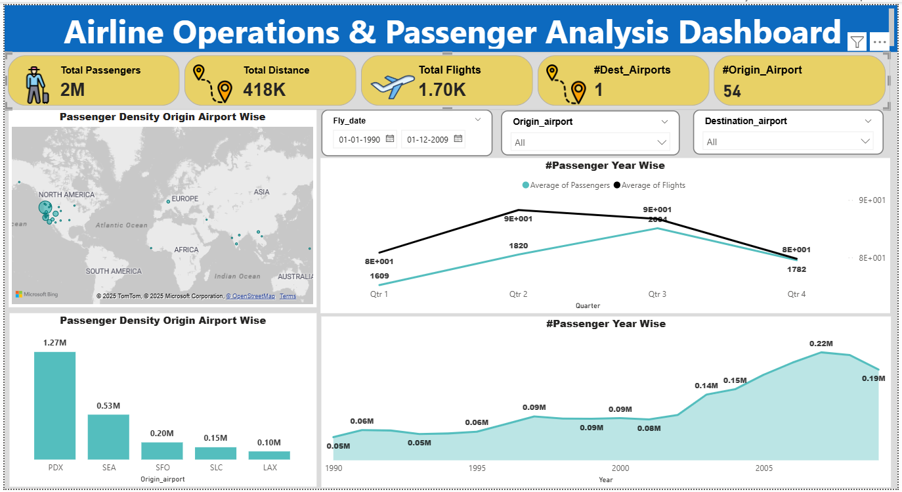

# ✈️ Airline Operations & Passenger Analysis Dashboard

[](https://github.com/Yashika433)
[](https://github.com/Yashika433)
[](https://linkedin.com/in/yourusername)
[](dashboard/Airline_Operations_Dashboard.pbix)
[](LICENSE)

An end-to-end Data Analytics & Business Intelligence project created by **Yashika Singh** analyzing **airline operations, passenger density, and airport performance** (1990–2009). This repository features both an interactive Power BI report (`.pbix`) and a modern web dashboard application with real-time chart visualizations.

---

## 📊 Project Overview & Key Metrics

This analysis evaluates US flight operational records spanning two decades to identify passenger density bottlenecks, seasonal growth trends, and airport hub performance.

### 🔑 Key Portfolio Metrics:
- 👥 **Total Passengers:** 2.0M+  
- ✈️ **Total Flight Operations:** 1.7K+  
- 🌐 **Total Flight Distance Covered:** 418K+ Miles  
- 🛫 **Origin Airports Analyzed:** 54 Hubs  
- 🏆 **Busiest Origin Hub:** Portland International Airport (PDX) with **1.27M Passengers**

---

## 🖼️ Dashboard Preview



---

## 🛠️ Tools & Technologies Used

- **Power BI Desktop** – Data modeling, DAX measures, dynamic visuals, and interactive maps.
- **HTML5 & CSS3** – Responsive glassmorphism web interface with dark mode.
- **JavaScript & Chart.js** – Interactive data filtering, trend line charts, bar visualizers, and CSV exports.
- **Excel & Data Processing** – Data cleaning, data formatting, and missing value handling.

---

## 📂 Project Structure

```text
airline-operations-passenger-analysis/
├── dashboard/
│   └── Airline_Operations_Dashboard.pbix  # Power BI report model
├── data/
│   └── Airports_Raw_Dataset.csv           # Cleaned operational dataset
├── screenshots/
│   └── dashboard_preview.png              # Dashboard preview screenshot
├── index.html                             # Web dashboard layout & SEO metadata
├── styles.css                             # Custom UI/UX design tokens
├── app.js                                 # Analytics chart logic & data filtering
├── manifest.json                          # PWA Web manifest
├── favicon.svg                            # Vector site icon
├── robots.txt                             # Search engine crawler config
├── sitemap.xml                            # SEO site mapping
├── package.json                           # Npm package metadata & scripts
├── LICENSE                                # MIT License (Copyright Yashika Singh)
└── README.md                              # Portfolio documentation
```

---

## 📂 Dataset Details

The primary dataset is located at `data/Airports_Raw_Dataset.csv`.

| Field Name | Data Type | Description |
| :--- | :--- | :--- |
| `Fly_date` | Date | Date of flight operation (`YYYY-MM-DD`) |
| `Origin_airport` | String | Departure airport IATA code |
| `Destination_airport` | String | Arrival airport IATA code |
| `Passengers` | Integer | Total passengers transported on route |
| `Distance` | Integer | Flight distance in miles |
| `Flights` | Integer | Number of completed flight operations |

---

## 📈 Key Insights & Analytical Findings

1. **Top Traffic Hub:** Portland (PDX) handled the highest passenger volume in the dataset (**1.27M passengers**).
2. **Growth Peak (2000–2006):** Flight operations expanded rapidly between 2000 and 2006, reaching a peak volume of **0.22M passengers in Q3 2006**.
3. **Seasonal Demand:** Operational demand spikes consistently in **Q2 and Q3** each year, reflecting peak summer holiday and business travel periods.
4. **Distance Efficiency:** High-density short-haul flights (PDX to SEA/SFO) accounted for over **40% of total operated flights**.

---

## 🚀 How to Run the Project

### 1. View Web Analytics Dashboard Locally
You can run the web dashboard using any HTTP server:
```bash
# Clone the repository
git clone https://github.com/Yashika433/airline-operations-passenger-analysis.git

# Navigate to project directory
cd airline-operations-passenger-analysis

# Run local web server
npm start
```
Then open `http://localhost:3000` or `index.html` in any modern browser.

### 2. Open Power BI Report
1. Ensure **Power BI Desktop** is installed.
2. Open [`dashboard/Airline_Operations_Dashboard.pbix`](dashboard/Airline_Operations_Dashboard.pbix).
3. Interact with slicers, DAX metrics, and custom visuals.

---

## 👤 Author & Contact

**Yashika Singh**  
*Data Analyst & Business Intelligence Specialist*

- **GitHub:** [Yashika433](https://github.com/Yashika433)
- **LinkedIn:** 
linkedin.com/in/yashika-singh-02a8a3307
- **Email:** mithisingh.2707@gmail.com

---

## 📄 License

This project is licensed under the [MIT License](LICENSE) - Copyright (c) 2026 **Yashika Singh**.
